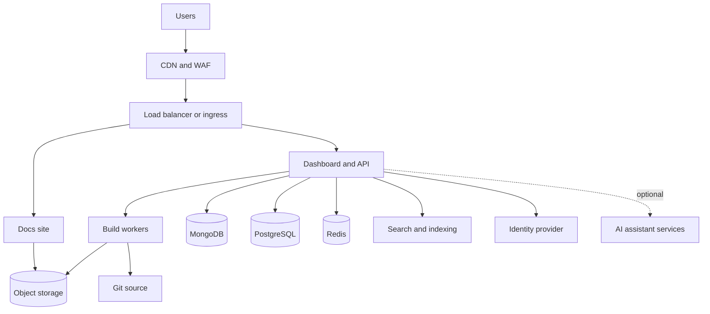

<Info>
  El autoalojamiento requiere un [plan Enterprise](https://mintlify.com/pricing?ref=self-host). Ponte en contacto con tu equipo de cuenta para dimensionar un despliegue.
</Info>

El autoalojamiento ejecuta Mintlify dentro de tu propia cuenta en la nube o centro de datos, de modo que tu contenido, tu pipeline de compilación, las analíticas y los logs se mantienen dentro de los límites de tu red. Está diseñado para equipos con requisitos de residencia de datos, cumplimiento normativo o air-gap que un despliegue alojado en la nube no puede satisfacer.

Cada despliegue autoalojado es un compromiso definido con tu equipo de cuenta, no una instalación autoservicio. Esta página describe qué aprovisionas, cómo se ejecuta el despliegue y las contrapartidas frente al alojamiento en la nube para que puedas evaluar el autoalojamiento antes de comprometerte con él.

<div id="platform-support">
  ## Plataformas compatibles
</div>

| Plataforma | Método |
| --- | --- |
| <Icon icon="/images/logos/aws-mark.svg" className="mr-2 my-2" /> Amazon Web Services | Aplicación de AWS Cloud Development Kit (CDK) |
| <Icon icon="/images/logos/azure.svg" className="mr-2 my-2" /> Microsoft Azure | Helm chart en Azure Kubernetes Service (AKS) |
| <Icon icon="/images/logos/gcp.svg" className="mr-2 my-2" /> Google Cloud | Helm chart en Google Kubernetes Engine (GKE) |
| <Icon icon="/images/logos/oracle-mark.svg" className="mr-2 my-2" /> Oracle Cloud | Helm chart en Oracle Container Engine for Kubernetes (OKE) |
| <Icon icon="/images/logos/openshift.svg" className="mr-2 my-2" /> Red Hat OpenShift | Helm chart |
| <Icon icon="/images/logos/kubernetes.svg" className="mr-2 my-2" /> Cualquier Kubernetes | Helm chart |

<div id="how-self-hosting-compares-to-cloud-hosting">
  ## Cómo se compara el autoalojamiento con el alojamiento en la nube
</div>

La redacción funciona igual en ambos modelos de alojamiento. Tu equipo mantiene el contenido con el editor o con su flujo de trabajo de Git, y cada cambio pasa por el proceso de revisión de tu repositorio. Lo que cambia es quién opera la plataforma y dónde residen los datos.

| Área | Alojado en la nube | Autoalojado |
| --- | --- | --- |
| Tiempo hasta el lanzamiento | El mismo día | Compromiso definido, normalmente semanas |
| Infraestructura | Mintlify opera todo | Tú operas el clúster, la red y los almacenes de datos. Mintlify entrega versiones con guías de actualización y da soporte a la capa de aplicación |
| Actualizaciones de la plataforma | Continuas y automáticas | Versiones que tú revisas y despliegas en tu propio calendario |
| Frontera de datos | Se procesan en la nube de Mintlify | El contenido, las compilaciones, las analíticas y los logs permanecen dentro de tu red, sin egreso a terceros |
| Funciones de IA | Activadas por defecto | Se entregan desactivadas hasta que tu equipo de seguridad o de gobernanza de IA las aprueba. Pueden ejecutarse contra tu propio endpoint de modelo, tu propia clave de API o la nube de Mintlify |
| Integraciones | Catálogo completo | Las integraciones que dependen de servicios de la nube de Mintlify no están disponibles |
| Supervisión | Gestionada por Mintlify | Conectas tu propia stack de observabilidad |

Los despliegues autoalojados suelen empezar acotados y ampliarse. Un camino habitual es empezar con documentación pública y luego añadir contenido autenticado, el editor web y las funciones de IA a medida que completas las revisiones de seguridad.

<div id="features">
  ## Funciones
</div>

Todo lo esencial para redactar, compilar y servir documentación se incluye en un despliegue autoalojado.

| Función | Disponibilidad | Notas |
| --- | :---: | --- |
| Sitio de documentación | <Icon icon="circle-check" color="#16a34a" /> | Renderizado completo, componentes y personalización de tema |
| Editor web | <Icon icon="circle-check" color="#16a34a" /> | Redacción desde el navegador |
| Flujo de trabajo respaldado por Git | <Icon icon="circle-check" color="#16a34a" /> | GitHub, GitHub Enterprise Server, GitLab incluida la versión autogestionada, Bitbucket o una API proxy de propiedad interna |
| Búsqueda | <Icon icon="circle-check" color="#16a34a" /> | Se ejecuta dentro de tu despliegue. El índice se reconstruye al publicar |
| Contenido autenticado | <Icon icon="circle-check" color="#16a34a" /> | Control de acceso a través de tu proveedor de identidad |
| SSO del dashboard | <Icon icon="circle-check" color="#16a34a" /> | OIDC o SAML |
| Analíticas | <Icon icon="circle-check" color="#16a34a" /> | Se recopilan y almacenan dentro de tu red |
| Widgets de analítica y soporte de terceros | <Icon icon="circle-check" color="#16a34a" /> | Se configuran con tus propias claves y se sirven desde el sitio de documentación |
| Exportación estática | <Icon icon="circle-check" color="#16a34a" /> | Paquetes autocontenidos para servir en entornos air-gapped |
| Versiones y rollback | <Icon icon="circle-check" color="#16a34a" /> | Cada versión fija versiones de imagen. Vuelve atrás redesplegando la versión anterior |
| Asistente y agente de IA | Opcional | Se entregan desactivados. Se ejecutan contra tu propio endpoint de modelo, tu propia clave de API o la nube de Mintlify |

Solo las superficies más pequeñas que dependen de servicios operados por Mintlify están limitadas a la nube: la aplicación de Slack, los conectores de terceros para automatizaciones del agente y las integraciones de generación de SDK.

<div id="architecture">
  ## Arquitectura
</div>

Un despliegue autoalojado es un conjunto de servicios con dependencias claras. Aprovisiona primero los almacenes de datos, luego los servicios que dependen de ellos y por último el borde.



| Recurso | Propósito | Requerido |
| --- | --- | :---: |
| Balanceador de carga o ingress | Terminación TLS y enrutamiento | <Icon icon="circle-check" color="#16a34a" /> |
| Sitio de documentación | Sirve la documentación renderizada | <Icon icon="circle-check" color="#16a34a" /> |
| Dashboard y API | Administración, autenticación y orquestación de compilaciones | <Icon icon="circle-check" color="#16a34a" /> |
| Workers de compilación | Compilan y publican los sitios de documentación | <Icon icon="circle-check" color="#16a34a" /> |
| MongoDB | Almacén de contenido | <Icon icon="circle-check" color="#16a34a" /> |
| PostgreSQL | Metadatos de despliegue y de usuario | <Icon icon="circle-check" color="#16a34a" /> |
| Redis | Cola de compilación y caché | <Icon icon="circle-check" color="#16a34a" /> |
| Almacenamiento de objetos | Paquetes de sitios compilados y exportaciones estáticas | <Icon icon="circle-check" color="#16a34a" /> |
| Búsqueda e indexación | Búsqueda de la documentación. El índice se reconstruye al publicar | <Icon icon="circle-check" color="#16a34a" /> |
| Proveedor de identidad | SSO OIDC o SAML para el dashboard y el contenido autenticado | <Icon icon="circle-check" color="#16a34a" /> |
| Servicios de asistente de IA | Funciones de asistente y agente | Opcional |

La fuente de tu documentación puede ser GitHub, GitHub Enterprise Server, GitLab (incluida la versión autogestionada) o Bitbucket.

Si tu organización no puede conceder credenciales de repositorio a un servicio de terceros, puedes anteponer a tu hosting de Git una API proxy de propiedad interna; los entornos totalmente air-gapped utilizan la [exportación estática](/es/api/static-export/overview) sin ninguna conexión a Git.

<div id="sizing">
  ### Dimensionamiento
</div>

Como punto de partida, un despliegue de producción se ejecuta con aproximadamente 45 a 60 vCPU, 160 a 220 GB de memoria y alrededor de 1 TB de almacenamiento en estado sólido repartido entre los servicios, mientras que los entornos no productivos utilizan aproximadamente la mitad. Tu equipo de cuenta dimensiona el despliegue contigo según el número de páginas, el tráfico y las funciones que actives.

<div id="set-up-your-platform">
  ## Configura tu plataforma
</div>

<Tabs>
  <Tab title="AWS" icon="/images/logos/aws-mark.svg">
    Los despliegues en AWS usan una aplicación de AWS CDK que aprovisiona y actualiza toda la stack en tu cuenta. La aplicación de CDK fija las imágenes de contenedor a versiones concretas, por lo que cada despliegue es reproducible y revisable.

    ### Qué aportas tú

    | Componente | Requisito | Notas |
    | --- | --- | --- |
    | Cómputo | Clúster de Amazon ECS | Ejecuta los servicios de Mintlify |
    | Almacén de contenido | Amazon DocumentDB | Compatible con MongoDB |
    | Almacén de metadatos | Amazon RDS for PostgreSQL | Metadatos de despliegue y de usuario |
    | Caché y cola | Amazon ElastiCache for Redis | Cola de compilación y caché |
    | Almacenamiento de objetos | Amazon S3 | Paquetes de sitios compilados y exportaciones estáticas |
    | CDN | Amazon CloudFront | Sirve el sitio de documentación en el borde |
    | Red | VPC con subredes públicas y privadas, Application Load Balancer | Aísla las cargas de trabajo |
    | TLS y DNS | AWS Certificate Manager, Amazon Route 53 | HTTPS y enrutamiento para tu dominio |
    | Secretos | AWS Secrets Manager | Credenciales de base de datos y secretos de firma |
    | Identidad | Proveedor OIDC o SAML | SSO del dashboard |

    ### Configuración

    <Steps>
      <Step title="Scope the deployment">
        Tu equipo de cuenta revisa la topología de tu red, tu hosting de Git, tu proveedor de identidad y tus requisitos de cumplimiento y, después, entrega la aplicación de CDK y el acceso a imágenes de contenedor versionadas.
      </Step>
      <Step title="Configure and deploy">
        Configura tu dominio, certificado y red en el contexto de CDK, revisa el change set y despliega.

        ```bash
        cdk diff
        cdk deploy --all
        ```
      </Step>
      <Step title="Connect Git and SSO">
        Concede al despliegue acceso a tus repositorios de documentación y conecta tu proveedor de identidad.
      </Step>
      <Step title="Cut over">
        Verifica las compilaciones y la búsqueda en tu dominio de staging y, a continuación, apunta el DNS de producción al despliegue.
      </Step>
    </Steps>
  </Tab>

  <Tab title="Kubernetes" icon="/images/logos/kubernetes.svg">
    Los despliegues en Kubernetes usan el Helm chart enterprise de Mintlify y se ejecutan en cualquier clúster de Kubernetes certificado. El mismo chart cubre Kubernetes gestionado en cualquier nube y clústeres on-premises:

    - **Azure**: AKS, con Microsoft Entra ID para SSO y servicios de datos gestionados de Azure.
    - **Google Cloud**: GKE, con Cloud SQL, Memorystore y Cloud Storage.
    - **Oracle Cloud**: OKE, con bases de datos gestionadas de OCI y OCI Object Storage.
    - **OpenShift**: incluye contextos de seguridad compatibles con OpenShift y usa Routes para el ingress.

    ### Qué aportas tú

    | Componente | Requisito | Notas |
    | --- | --- | --- |
    | Clúster | Clúster de Kubernetes u OpenShift | Aloja el release de Helm |
    | Almacén de contenido | MongoDB | Gestionado o dentro del clúster |
    | Almacén de metadatos | PostgreSQL | Gestionado o dentro del clúster |
    | Caché y cola | Redis | Cola de compilación y caché |
    | Almacenamiento de objetos | Bucket compatible con S3 | Paquetes de sitios compilados y exportaciones estáticas |
    | Ingress | Controlador de ingress o Route de OpenShift con TLS | Sirve HTTPS. Se recomienda un WAF por delante |
    | Registro | Registro de contenedores privado | Aloja las imágenes entregadas |
    | Identidad | Proveedor OIDC o SAML | SSO del dashboard |

    ### Configuración

    <Steps>
      <Step title="Scope the deployment">
        Tu equipo de cuenta revisa tu clúster, tu hosting de Git, tu proveedor de identidad y tus requisitos de cumplimiento y, después, entrega el Helm chart, una plantilla de values e imágenes de contenedor versionadas para tu registro.
      </Step>
      <Step title="Provision data stores">
        Levanta MongoDB, PostgreSQL, Redis y almacenamiento de objetos, gestionados por tu proveedor de nube o dentro del clúster.
      </Step>
      <Step title="Configure and install">
        Apunta el archivo de values a tus almacenes de datos, ingress y registro, y luego instala el release.

        ```bash
        helm upgrade --install mintlify ./mintlify-enterprise \
          --namespace mintlify --create-namespace -f values.yaml
        ```
      </Step>
      <Step title="Connect Git and SSO, then cut over">
        Concede al despliegue acceso a tus repositorios de documentación, conecta tu proveedor de identidad, verifica en staging y apunta el DNS de producción al despliegue.
      </Step>
    </Steps>
  </Tab>
</Tabs>

<div id="updates">
  ## Actualizaciones
</div>

Las actualizaciones de plataforma y las actualizaciones de contenido evolucionan de forma independiente. Tú controlas cuándo cambia la plataforma, y tu documentación se mantiene al día por sí sola.

<div id="platform-updates">
  ### Actualizaciones de la plataforma
</div>

Mintlify entrega versiones con guías de actualización y notas de la versión a través de tu equipo de cuenta. Cada versión fija versiones concretas de imagen, de modo que puedes probar un release en un entorno no productivo antes de desplegarlo y volver a la versión anterior si es necesario.

<CodeGroup>

```bash AWS (CDK)
# revisa el change set del nuevo release y despliégalo
cdk diff
cdk deploy --all
```

```bash Kubernetes (Helm)
# actualiza a un release entregado o vuelve atrás
helm upgrade mintlify ./mintlify-enterprise \
  --namespace mintlify -f values.yaml
helm rollback mintlify
```

</CodeGroup>

Las actualizaciones se despliegan sin tiempo de inactividad. Se levantan nuevas tareas o pods, superan las comprobaciones de salud y reemplazan a los anteriores.

<div id="content-updates">
  ### Actualizaciones de contenido
</div>

El contenido fluye a través de tu fuente de Git, no a través de los releases de plataforma. Cuando haces push a tu repositorio de documentación, los workers de compilación reconstruyen el sitio y lo publican automáticamente en el almacenamiento de objetos. Los cambios de contenido nunca requieren un despliegue de plataforma.

<div id="air-gapped-deployments">
  ## Despliegues air-gapped
</div>

Los entornos sin ruta para webhooks de Git sirven la documentación como [paquetes de exportación estática](/es/api/static-export/overview). Se publican compilaciones autocontenidas de tu sitio en el almacenamiento de objetos y se sirven a través de tu CDN. Regenera el paquete cuando cambie el contenido, o automatiza el ciclo con una GitHub Action. Las funciones de IA que requieren acceso de red saliente se desactivan en despliegues air-gapped.

<div id="next-steps">
  ## Próximos pasos
</div>

<Columns cols={2}>
  <Card title="Habla con tu equipo de cuenta" icon="messages-square" href="https://www.mintlify.com/enterprise">
    Dimensiona un despliegue autoalojado en tu plataforma y planifica tu lanzamiento.
  </Card>
  <Card title="Exportación estática" icon="package" href="/es/api/static-export/overview">
    Genera paquetes autocontenidos de tu documentación para servirlos en entornos air-gapped.
  </Card>
</Columns>
