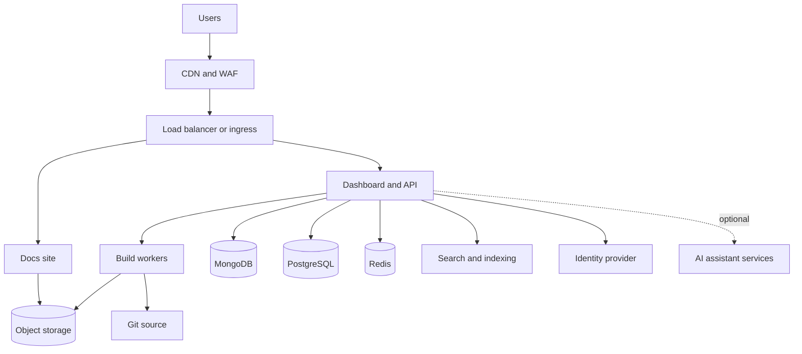

<Info>
  L'auto-hébergement nécessite un [plan Enterprise](https://mintlify.com/pricing?ref=self-host). Contactez votre équipe de compte pour cadrer un déploiement.
</Info>

L'auto-hébergement exécute Mintlify dans votre propre compte cloud ou data center, afin que votre contenu, votre pipeline de build, vos analyses et vos logs restent à l'intérieur des limites de votre réseau. Il est conçu pour les équipes ayant des exigences de résidence des données, de conformité ou d'air-gap auxquelles un déploiement hébergé dans le cloud ne peut pas répondre.

Chaque déploiement auto-hébergé est un engagement cadré avec votre équipe de compte, et non une installation en libre-service. Cette page décrit ce que vous provisionnez, comment le déploiement fonctionne et les compromis par rapport à l'hébergement cloud, afin que vous puissiez évaluer l'auto-hébergement avant de vous y engager.

<div id="platform-support">
  ## Plateformes prises en charge
</div>

| Plateforme | Méthode |
| --- | --- |
| <Icon icon="/images/logos/aws-mark.svg" className="mr-2 my-2" /> Amazon Web Services | Application AWS Cloud Development Kit (CDK) |
| <Icon icon="/images/logos/azure.svg" className="mr-2 my-2" /> Microsoft Azure | Helm chart sur Azure Kubernetes Service (AKS) |
| <Icon icon="/images/logos/gcp.svg" className="mr-2 my-2" /> Google Cloud | Helm chart sur Google Kubernetes Engine (GKE) |
| <Icon icon="/images/logos/oracle-mark.svg" className="mr-2 my-2" /> Oracle Cloud | Helm chart sur Oracle Container Engine for Kubernetes (OKE) |
| <Icon icon="/images/logos/openshift.svg" className="mr-2 my-2" /> Red Hat OpenShift | Helm chart |
| <Icon icon="/images/logos/kubernetes.svg" className="mr-2 my-2" /> Tout Kubernetes | Helm chart |

<div id="how-self-hosting-compares-to-cloud-hosting">
  ## Comparaison de l'auto-hébergement et de l'hébergement cloud
</div>

La rédaction fonctionne de la même manière dans les deux modèles d'hébergement. Votre équipe entretient le contenu avec l'éditeur ou son workflow Git, et chaque modification suit le processus de revue de votre dépôt. Ce qui change, c'est qui exploite la plateforme et où résident les données.

| Domaine | Hébergé dans le cloud | Auto-hébergé |
| --- | --- | --- |
| Délai de mise en service | Le jour même | Engagement cadré, généralement plusieurs semaines |
| Infrastructure | Mintlify exploite tout | Vous exploitez le cluster, le réseau et les magasins de données. Mintlify livre des versions numérotées avec des guides de mise à niveau et prend en charge la couche applicative |
| Mises à jour de la plateforme | Continues et automatiques | Versions numérotées que vous examinez et déployez selon votre propre calendrier |
| Frontière des données | Traitées dans le cloud de Mintlify | Le contenu, les builds, les analyses et les logs restent à l'intérieur de votre réseau, sans sortie vers des tiers |
| Fonctionnalités d'IA | Activées par défaut | Livrées désactivées jusqu'à ce que votre équipe de sécurité ou de gouvernance de l'IA les approuve. Peuvent s'exécuter sur votre propre endpoint de modèle, votre propre clé API ou le cloud Mintlify |
| Intégrations | Catalogue complet | Les intégrations qui dépendent des services cloud de Mintlify ne sont pas disponibles |
| Supervision | Gérée par Mintlify | Vous branchez votre propre stack d'observabilité |

Les déploiements auto-hébergés commencent en général de manière restreinte et s'étendent. Un cheminement courant consiste à démarrer avec de la documentation publique, puis à ajouter du contenu authentifié, l'éditeur web et les fonctionnalités d'IA à mesure que vous validez les revues de sécurité.

<div id="features">
  ## Fonctionnalités
</div>

Tout ce qui est essentiel à la rédaction, au build et à la diffusion de la documentation est inclus dans un déploiement auto-hébergé.

| Fonctionnalité | Disponibilité | Notes |
| --- | :---: | --- |
| Site de documentation | <Icon icon="circle-check" color="#16a34a" /> | Rendu complet, composants et personnalisation du thème |
| Éditeur web | <Icon icon="circle-check" color="#16a34a" /> | Rédaction depuis le navigateur |
| Workflow adossé à Git | <Icon icon="circle-check" color="#16a34a" /> | GitHub, GitHub Enterprise Server, GitLab y compris self-managed, Bitbucket, ou une API proxy détenue en interne |
| Recherche | <Icon icon="circle-check" color="#16a34a" /> | S'exécute à l'intérieur de votre déploiement. L'index est reconstruit à la publication |
| Contenu authentifié | <Icon icon="circle-check" color="#16a34a" /> | Contrôle d'accès via votre fournisseur d'identité |
| SSO du dashboard | <Icon icon="circle-check" color="#16a34a" /> | OIDC ou SAML |
| Analyses | <Icon icon="circle-check" color="#16a34a" /> | Collectées et stockées à l'intérieur de votre réseau |
| Widgets d'analyse et de support tiers | <Icon icon="circle-check" color="#16a34a" /> | Configurés avec vos propres clés, servis depuis le site de documentation |
| Export statique | <Icon icon="circle-check" color="#16a34a" /> | Bundles autonomes pour une diffusion en air-gapped |
| Versions et rollback | <Icon icon="circle-check" color="#16a34a" /> | Chaque version fige les versions d'image. Revenez en arrière en redéployant la version précédente |
| Assistant et agent d'IA | Optionnel | Livrés désactivés. S'exécutent sur votre propre endpoint de modèle, votre propre clé API ou le cloud Mintlify |

Seules quelques surfaces plus restreintes qui dépendent de services exploités par Mintlify sont réservées au cloud : l'application Slack, les connecteurs tiers pour les automatisations de l'agent et les intégrations de génération de SDK.

<div id="architecture">
  ## Architecture
</div>

Un déploiement auto-hébergé est un ensemble de services avec des dépendances claires. Provisionnez d'abord les magasins de données, puis les services qui en dépendent, puis la périphérie.



| Ressource | Rôle | Requis |
| --- | --- | :---: |
| Équilibreur de charge ou ingress | Terminaison TLS et routage | <Icon icon="circle-check" color="#16a34a" /> |
| Site de documentation | Sert la documentation rendue | <Icon icon="circle-check" color="#16a34a" /> |
| Dashboard et API | Administration, authentification et orchestration des builds | <Icon icon="circle-check" color="#16a34a" /> |
| Workers de build | Compilent et publient les sites de documentation | <Icon icon="circle-check" color="#16a34a" /> |
| MongoDB | Magasin de contenu | <Icon icon="circle-check" color="#16a34a" /> |
| PostgreSQL | Métadonnées de déploiement et d'utilisateurs | <Icon icon="circle-check" color="#16a34a" /> |
| Redis | File d'attente de build et cache | <Icon icon="circle-check" color="#16a34a" /> |
| Stockage d'objets | Bundles de sites compilés et exports statiques | <Icon icon="circle-check" color="#16a34a" /> |
| Recherche et indexation | Recherche dans la documentation. L'index est reconstruit à la publication | <Icon icon="circle-check" color="#16a34a" /> |
| Fournisseur d'identité | SSO OIDC ou SAML pour le dashboard et le contenu authentifié | <Icon icon="circle-check" color="#16a34a" /> |
| Services d'assistant d'IA | Fonctionnalités d'assistant et d'agent | Optionnel |

La source de votre documentation peut être GitHub, GitHub Enterprise Server, GitLab (y compris self-managed) ou Bitbucket.

Si votre organisation ne peut pas fournir d'identifiants de dépôt à un service tiers, vous pouvez à la place placer votre hébergement Git derrière une API proxy détenue en interne, et les environnements totalement air-gapped utilisent l'[export statique](/fr/api/static-export/overview) sans aucune connexion Git.

<div id="sizing">
  ### Dimensionnement
</div>

Comme point de départ, un déploiement de production s'exécute sur environ 45 à 60 vCPU, 160 à 220 Go de mémoire et environ 1 To de stockage SSD réparti entre les services, les environnements hors production tournant à environ la moitié. Votre équipe de compte dimensionne le déploiement avec vous en fonction du nombre de pages, du trafic et des fonctionnalités que vous activez.

<div id="set-up-your-platform">
  ## Mettre en place votre plateforme
</div>

<Tabs>
  <Tab title="AWS" icon="/images/logos/aws-mark.svg">
    Les déploiements AWS utilisent une application AWS CDK qui provisionne et met à jour l'ensemble de la stack dans votre compte. L'application CDK fige les images de conteneur sur des versions spécifiques, de sorte que chaque déploiement est reproductible et vérifiable.

    ### Ce que vous fournissez

    | Composant | Exigence | Notes |
    | --- | --- | --- |
    | Calcul | Cluster Amazon ECS | Exécute les services Mintlify |
    | Magasin de contenu | Amazon DocumentDB | Compatible MongoDB |
    | Magasin de métadonnées | Amazon RDS for PostgreSQL | Métadonnées de déploiement et d'utilisateurs |
    | Cache et file d'attente | Amazon ElastiCache for Redis | File d'attente de build et cache |
    | Stockage d'objets | Amazon S3 | Bundles de sites compilés et exports statiques |
    | CDN | Amazon CloudFront | Sert le site de documentation en périphérie |
    | Réseau | VPC avec sous-réseaux publics et privés, Application Load Balancer | Isole les charges de travail |
    | TLS et DNS | AWS Certificate Manager, Amazon Route 53 | HTTPS et routage pour votre domaine |
    | Secrets | AWS Secrets Manager | Identifiants de base de données et secrets de signature |
    | Identité | Fournisseur OIDC ou SAML | SSO du dashboard |

    ### Configuration

    <Steps>
      <Step title="Scope the deployment">
        Votre équipe de compte examine votre topologie réseau, votre hébergement Git, votre fournisseur d'identité et vos exigences de conformité, puis livre l'application CDK et l'accès aux images de conteneur numérotées.
      </Step>
      <Step title="Configure and deploy">
        Définissez votre domaine, votre certificat et votre réseau dans le contexte CDK, examinez le change set et déployez.

        ```bash
        cdk diff
        cdk deploy --all
        ```
      </Step>
      <Step title="Connect Git and SSO">
        Accordez au déploiement l'accès à vos dépôts de documentation et connectez votre fournisseur d'identité.
      </Step>
      <Step title="Cut over">
        Vérifiez les builds et la recherche sur votre domaine de staging, puis pointez votre DNS de production vers le déploiement.
      </Step>
    </Steps>
  </Tab>

  <Tab title="Kubernetes" icon="/images/logos/kubernetes.svg">
    Les déploiements Kubernetes utilisent le Helm chart enterprise de Mintlify et fonctionnent sur n'importe quel cluster Kubernetes certifié. Le même chart couvre Kubernetes managé sur tous les clouds et les clusters on-premises :

    - **Azure** : AKS, avec Microsoft Entra ID pour le SSO et les services de données managés Azure.
    - **Google Cloud** : GKE, avec Cloud SQL, Memorystore et Cloud Storage.
    - **Oracle Cloud** : OKE, avec les bases de données managées OCI et OCI Object Storage.
    - **OpenShift** : livre des contextes de sécurité compatibles OpenShift et utilise les Routes pour l'ingress.

    ### Ce que vous fournissez

    | Composant | Exigence | Notes |
    | --- | --- | --- |
    | Cluster | Cluster Kubernetes ou OpenShift | Héberge la release Helm |
    | Magasin de contenu | MongoDB | Managé ou dans le cluster |
    | Magasin de métadonnées | PostgreSQL | Managé ou dans le cluster |
    | Cache et file d'attente | Redis | File d'attente de build et cache |
    | Stockage d'objets | Bucket compatible S3 | Bundles de sites compilés et exports statiques |
    | Ingress | Contrôleur d'ingress ou Route OpenShift avec TLS | Sert HTTPS. Un WAF en amont est recommandé |
    | Registre | Registre de conteneurs privé | Héberge les images livrées |
    | Identité | Fournisseur OIDC ou SAML | SSO du dashboard |

    ### Configuration

    <Steps>
      <Step title="Scope the deployment">
        Votre équipe de compte examine votre cluster, votre hébergement Git, votre fournisseur d'identité et vos exigences de conformité, puis livre le Helm chart, un modèle de values et des images de conteneur numérotées pour votre registre.
      </Step>
      <Step title="Provision data stores">
        Mettez en place MongoDB, PostgreSQL, Redis et le stockage d'objets, managés par votre fournisseur cloud ou dans le cluster.
      </Step>
      <Step title="Configure and install">
        Pointez le fichier values vers vos magasins de données, votre ingress et votre registre, puis installez la release.

        ```bash
        helm upgrade --install mintlify ./mintlify-enterprise \
          --namespace mintlify --create-namespace -f values.yaml
        ```
      </Step>
      <Step title="Connect Git and SSO, then cut over">
        Accordez au déploiement l'accès à vos dépôts de documentation, connectez votre fournisseur d'identité, vérifiez en staging et pointez le DNS de production vers le déploiement.
      </Step>
    </Steps>
  </Tab>
</Tabs>

<div id="updates">
  ## Mises à jour
</div>

Les mises à jour de la plateforme et les mises à jour du contenu évoluent indépendamment. Vous contrôlez le moment où la plateforme change, et votre documentation reste à jour d'elle-même.

<div id="platform-updates">
  ### Mises à jour de la plateforme
</div>

Mintlify livre des versions numérotées avec des guides de mise à niveau et des notes de version, via votre équipe de compte. Chaque version fige des versions d'image spécifiques, ce qui vous permet de tester une release dans un environnement hors production avant de la déployer et de revenir à la version précédente si besoin.

<CodeGroup>

```bash AWS (CDK)
# examinez le change set pour la nouvelle version, puis déployez-la
cdk diff
cdk deploy --all
```

```bash Kubernetes (Helm)
# mettez à niveau vers une version livrée, ou revenez en arrière
helm upgrade mintlify ./mintlify-enterprise \
  --namespace mintlify -f values.yaml
helm rollback mintlify
```

</CodeGroup>

Les mises à jour se déploient sans interruption de service. De nouvelles tâches ou de nouveaux pods démarrent, passent les health checks et remplacent les anciens.

<div id="content-updates">
  ### Mises à jour du contenu
</div>

Le contenu passe par votre source Git, pas par les releases de la plateforme. Lorsque vous poussez sur votre dépôt de documentation, les workers de build reconstruisent le site et le publient automatiquement dans le stockage d'objets. Les changements de contenu ne nécessitent jamais un déploiement de plateforme.

<div id="air-gapped-deployments">
  ## Déploiements air-gapped
</div>

Les environnements sans chemin de webhook Git servent la documentation sous forme de [bundles d'export statique](/fr/api/static-export/overview). Des builds autonomes de votre site sont publiés dans le stockage d'objets et servis via votre CDN. Régénérez le bundle quand le contenu change, ou automatisez la boucle avec une GitHub Action. Les fonctionnalités d'IA qui nécessitent un accès réseau sortant sont désactivées dans les déploiements air-gapped.

<div id="next-steps">
  ## Étapes suivantes
</div>

<Columns cols={2}>
  <Card title="Parlez à votre équipe de compte" icon="messages-square" href="https://www.mintlify.com/enterprise">
    Cadrez un déploiement auto-hébergé sur votre plateforme et planifiez votre lancement.
  </Card>
  <Card title="Export statique" icon="package" href="/fr/api/static-export/overview">
    Générez des bundles autonomes de votre documentation pour une diffusion en air-gapped.
  </Card>
</Columns>
