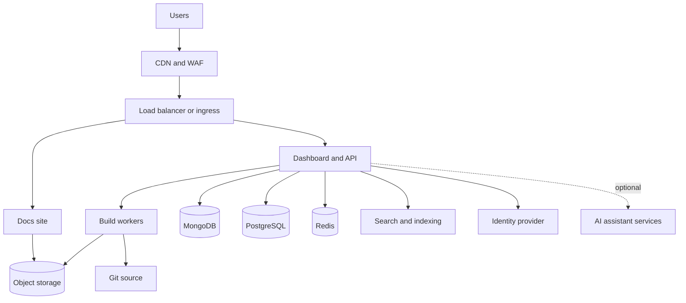

<Info>
  自托管需要 [Enterprise 套餐](https://mintlify.com/pricing?ref=self-host)。请联系你的客户团队来规划部署。
</Info>

自托管将 Mintlify 运行在你自己的云账户或数据中心中，因此你的内容、构建流水线、分析数据和日志都会保留在你的网络边界内。它面向那些有数据驻留、合规或气隙（air-gap）需求，而云托管部署无法满足的团队。

每次自托管部署都是与你的客户团队共同确定范围的合作项目，而不是自助安装。本页描述你需要配置的内容、部署的运行方式以及与云托管相比的取舍，帮助你在决定采用自托管之前进行评估。

<div id="platform-support">
  ## 支持的平台
</div>

| 平台 | 方式 |
| --- | --- |
| <Icon icon="/images/logos/aws-mark.svg" className="mr-2 my-2" /> Amazon Web Services | AWS Cloud Development Kit (CDK) 应用 |
| <Icon icon="/images/logos/azure.svg" className="mr-2 my-2" /> Microsoft Azure | 在 Azure Kubernetes Service (AKS) 上使用 Helm chart |
| <Icon icon="/images/logos/gcp.svg" className="mr-2 my-2" /> Google Cloud | 在 Google Kubernetes Engine (GKE) 上使用 Helm chart |
| <Icon icon="/images/logos/oracle-mark.svg" className="mr-2 my-2" /> Oracle Cloud | 在 Oracle Container Engine for Kubernetes (OKE) 上使用 Helm chart |
| <Icon icon="/images/logos/openshift.svg" className="mr-2 my-2" /> Red Hat OpenShift | Helm chart |
| <Icon icon="/images/logos/kubernetes.svg" className="mr-2 my-2" /> 任意 Kubernetes | Helm chart |

<div id="how-self-hosting-compares-to-cloud-hosting">
  ## 自托管与云托管的对比
</div>

在两种托管模式下，内容创作的方式是相同的。你的团队通过编辑器或其 Git 工作流维护内容，每次变更都会经过你仓库的评审流程。变化的是由谁来运行平台，以及数据存放在哪里。

| 方面 | 云托管 | 自托管 |
| --- | --- | --- |
| 上线时间 | 当天即可 | 需按范围协作，通常需要数周 |
| 基础设施 | 由 Mintlify 运行全部内容 | 由你运行集群、网络和数据存储。Mintlify 提供带升级指南的版本化发布，并为应用层提供支持 |
| 平台更新 | 持续、自动 | 由你审阅并按自己的节奏部署的版本化发布 |
| 数据边界 | 在 Mintlify 云端处理 | 内容、构建、分析和日志都保留在你的网络内，没有向第三方的外发流量 |
| AI 功能 | 默认开启 | 交付时默认禁用，直到你的安全或 AI 治理团队批准后才启用。可以对接你自己的模型端点、你自己的 API key 或 Mintlify 云 |
| 集成 | 完整目录 | 依赖 Mintlify 云服务的集成不可用 |
| 监控 | 由 Mintlify 管理 | 由你接入自己的可观测性技术栈 |

自托管部署通常从较小的范围开始，然后逐步扩展。常见的路径是先从公共文档入手，随着安全评审的完成，再逐步添加认证内容、Web 编辑器和 AI 功能。

<div id="features">
  ## 功能
</div>

创作、构建和分发文档所需的所有核心功能都包含在自托管部署中。

| 功能 | 可用性 | 说明 |
| --- | :---: | --- |
| 文档站点 | <Icon icon="circle-check" color="#16a34a" /> | 完整渲染、组件和主题定制 |
| Web 编辑器 | <Icon icon="circle-check" color="#16a34a" /> | 基于浏览器的内容创作 |
| 基于 Git 的工作流 | <Icon icon="circle-check" color="#16a34a" /> | GitHub、GitHub Enterprise Server、GitLab（包括自管版）、Bitbucket，或内部拥有的代理 API |
| 搜索 | <Icon icon="circle-check" color="#16a34a" /> | 在你的部署内运行。发布时重建索引 |
| 认证内容 | <Icon icon="circle-check" color="#16a34a" /> | 通过你的身份提供方进行访问控制 |
| 控制台 SSO | <Icon icon="circle-check" color="#16a34a" /> | OIDC 或 SAML |
| 分析 | <Icon icon="circle-check" color="#16a34a" /> | 在你的网络内采集和存储 |
| 第三方分析和支持挂件 | <Icon icon="circle-check" color="#16a34a" /> | 使用你自己的密钥进行配置，通过文档站点提供服务 |
| 静态导出 | <Icon icon="circle-check" color="#16a34a" /> | 用于气隙环境的自包含 bundle |
| 版本化发布和回滚 | <Icon icon="circle-check" color="#16a34a" /> | 每个版本都固定镜像版本。通过重新部署上一个版本进行回滚 |
| AI 助手和智能体 | 可选 | 默认禁用交付。可对接你自己的模型端点、你自己的 API key 或 Mintlify 云 |

只有少数依赖 Mintlify 运营服务的小范围功能仅限云端提供：Slack 应用、用于智能体自动化的第三方连接器，以及 SDK 生成集成。

<div id="architecture">
  ## 架构
</div>

自托管部署是一组具有清晰依赖关系的服务。先配置数据存储，再配置依赖它们的服务，最后配置边缘。



| 资源 | 用途 | 必需 |
| --- | --- | :---: |
| 负载均衡器或 ingress | TLS 终止和路由 | <Icon icon="circle-check" color="#16a34a" /> |
| 文档站点 | 提供渲染后的文档 | <Icon icon="circle-check" color="#16a34a" /> |
| 控制台和 API | 管理、认证和构建编排 | <Icon icon="circle-check" color="#16a34a" /> |
| 构建 worker | 构建并发布文档站点 | <Icon icon="circle-check" color="#16a34a" /> |
| MongoDB | 内容存储 | <Icon icon="circle-check" color="#16a34a" /> |
| PostgreSQL | 部署和用户元数据 | <Icon icon="circle-check" color="#16a34a" /> |
| Redis | 构建队列和缓存 | <Icon icon="circle-check" color="#16a34a" /> |
| 对象存储 | 构建产物和静态导出 | <Icon icon="circle-check" color="#16a34a" /> |
| 搜索和索引 | 文档搜索。发布时重建索引 | <Icon icon="circle-check" color="#16a34a" /> |
| 身份提供方 | 用于控制台和认证内容的 OIDC 或 SAML SSO | <Icon icon="circle-check" color="#16a34a" /> |
| AI 助手服务 | 助手和智能体功能 | 可选 |

你的文档源可以是 GitHub、GitHub Enterprise Server、GitLab（包括自管版）或 Bitbucket。

如果你的组织无法向第三方服务授予仓库凭据，也可以在 Git 托管前放置一个内部拥有的代理 API；而完全气隙的环境则使用[静态导出](/zh/api/static-export/overview)，无需任何 Git 连接。

<div id="sizing">
  ### 规格评估
</div>

作为起点，一个生产环境部署大约需要 45 到 60 个 vCPU、160 到 220 GB 内存，以及各服务合计约 1 TB 的固态存储，非生产环境大约为生产环境的一半。你的客户团队会根据页面数量、流量和你启用的功能与你共同确定部署规格。

<div id="set-up-your-platform">
  ## 搭建你的平台
</div>

<Tabs>
  <Tab title="AWS" icon="/images/logos/aws-mark.svg">
    AWS 部署使用 AWS CDK 应用，在你的账户中配置并更新整个技术栈。CDK 应用将容器镜像固定到特定版本，因此每次部署都是可复现且可评审的。

    ### 你需要提供的资源

    | 组件 | 要求 | 说明 |
    | --- | --- | --- |
    | 计算 | Amazon ECS 集群 | 运行 Mintlify 服务 |
    | 内容存储 | Amazon DocumentDB | 与 MongoDB 兼容 |
    | 元数据存储 | Amazon RDS for PostgreSQL | 部署和用户元数据 |
    | 缓存和队列 | Amazon ElastiCache for Redis | 构建队列和缓存 |
    | 对象存储 | Amazon S3 | 构建产物和静态导出 |
    | CDN | Amazon CloudFront | 在边缘提供文档站点 |
    | 网络 | 带公共和私有子网的 VPC，Application Load Balancer | 隔离工作负载 |
    | TLS 和 DNS | AWS Certificate Manager、Amazon Route 53 | 为你的域名提供 HTTPS 和路由 |
    | 密钥 | AWS Secrets Manager | 数据库凭据和签名密钥 |
    | 身份 | OIDC 或 SAML 提供方 | 控制台 SSO |

    ### 配置步骤

    <Steps>
      <Step title="Scope the deployment">
        你的客户团队会审阅你的网络拓扑、Git 托管、身份提供方和合规要求，然后交付 CDK 应用以及版本化容器镜像的访问权限。
      </Step>
      <Step title="Configure and deploy">
        在 CDK 上下文中设置你的域名、证书和网络，审阅 change set 并进行部署。

        ```bash
        cdk diff
        cdk deploy --all
        ```
      </Step>
      <Step title="Connect Git and SSO">
        授予部署访问你文档仓库的权限，并接入你的身份提供方。
      </Step>
      <Step title="Cut over">
        在预发环境域名上验证构建和搜索，然后将生产 DNS 指向该部署。
      </Step>
    </Steps>
  </Tab>

  <Tab title="Kubernetes" icon="/images/logos/kubernetes.svg">
    Kubernetes 部署使用 Mintlify 的企业版 Helm chart，可运行在任何经过认证的 Kubernetes 集群上。同一个 chart 同时覆盖各家云上的托管 Kubernetes 和本地集群：

    - **Azure**：AKS，使用 Microsoft Entra ID 进行 SSO，并使用 Azure 托管数据服务。
    - **Google Cloud**：GKE，使用 Cloud SQL、Memorystore 和 Cloud Storage。
    - **Oracle Cloud**：OKE，使用 OCI 托管数据库和 OCI Object Storage。
    - **OpenShift**：附带兼容 OpenShift 的安全上下文，并使用 Routes 作为 ingress。

    ### 你需要提供的资源

    | 组件 | 要求 | 说明 |
    | --- | --- | --- |
    | 集群 | Kubernetes 或 OpenShift 集群 | 承载 Helm release |
    | 内容存储 | MongoDB | 托管或集群内运行 |
    | 元数据存储 | PostgreSQL | 托管或集群内运行 |
    | 缓存和队列 | Redis | 构建队列和缓存 |
    | 对象存储 | S3 兼容的 bucket | 构建产物和静态导出 |
    | Ingress | 支持 TLS 的 ingress 控制器或 OpenShift Route | 提供 HTTPS。建议在前面加一个 WAF |
    | 镜像仓库 | 私有容器镜像仓库 | 存放交付的镜像 |
    | 身份 | OIDC 或 SAML 提供方 | 控制台 SSO |

    ### 配置步骤

    <Steps>
      <Step title="Scope the deployment">
        你的客户团队会审阅你的集群、Git 托管、身份提供方和合规要求，然后交付 Helm chart、values 模板以及供你镜像仓库使用的版本化容器镜像。
      </Step>
      <Step title="Provision data stores">
        搭建 MongoDB、PostgreSQL、Redis 和对象存储，可由你的云厂商托管或运行在集群内。
      </Step>
      <Step title="Configure and install">
        将 values 文件指向你的数据存储、ingress 和镜像仓库，然后安装 release。

        ```bash
        helm upgrade --install mintlify ./mintlify-enterprise \
          --namespace mintlify --create-namespace -f values.yaml
        ```
      </Step>
      <Step title="Connect Git and SSO, then cut over">
        授予部署访问你文档仓库的权限，接入你的身份提供方，在预发环境验证后，将生产 DNS 指向该部署。
      </Step>
    </Steps>
  </Tab>
</Tabs>

<div id="updates">
  ## 更新
</div>

平台更新和内容更新是相互独立的。你控制平台何时变更，而你的文档也会独立地保持最新。

<div id="platform-updates">
  ### 平台更新
</div>

Mintlify 通过你的客户团队交付带有升级指南和发布说明的版本化发布。每个版本都固定特定的镜像版本，因此你可以先在非生产环境中测试某个 release，然后再进行部署，如有需要还可以回滚到上一个版本。

<CodeGroup>

```bash AWS (CDK)
# 审阅新版本的 change set，然后进行部署
cdk diff
cdk deploy --all
```

```bash Kubernetes (Helm)
# 升级到已交付的版本，或进行回滚
helm upgrade mintlify ./mintlify-enterprise \
  --namespace mintlify -f values.yaml
helm rollback mintlify
```

</CodeGroup>

更新过程零停机。新的任务或 pod 会启动、通过健康检查，然后替换掉旧的实例。

<div id="content-updates">
  ### 内容更新
</div>

内容通过你的 Git 源流转，而不是通过平台发布进行。当你向文档仓库推送提交时，构建 worker 会重新构建站点并自动发布到对象存储。内容变更从不需要平台部署。

<div id="air-gapped-deployments">
  ## 气隙部署
</div>

没有 Git webhook 通路的环境将文档作为[静态导出 bundle](/zh/api/static-export/overview) 进行分发。你站点的自包含构建被发布到对象存储，并通过你的 CDN 提供服务。内容变更时重新生成 bundle，或者使用 GitHub Action 自动化整个流程。在气隙部署中，需要外部网络访问的 AI 功能会被禁用。

<div id="next-steps">
  ## 后续步骤
</div>

<Columns cols={2}>
  <Card title="联系你的客户团队" icon="messages-square" href="https://www.mintlify.com/enterprise">
    在你的平台上规划自托管部署，并制定上线计划。
  </Card>
  <Card title="静态导出" icon="package" href="/zh/api/static-export/overview">
    生成文档的自包含 bundle，以在气隙环境中提供服务。
  </Card>
</Columns>
